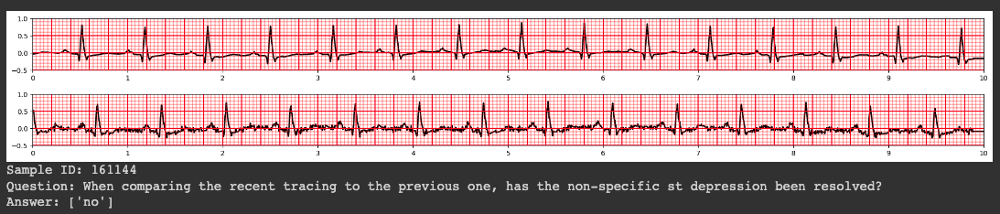
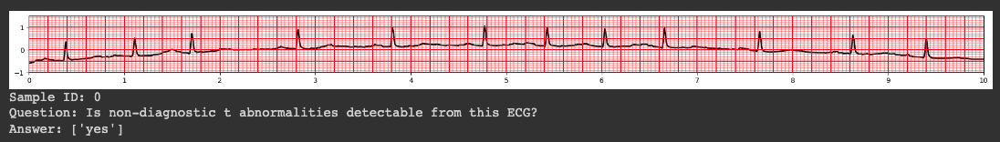

# ECG-QA: A Comprehensive Question Answering Dataset Combined With Electrocardiogram

This is the official repository for distributing ECG-QA dataset.

For more detailed information about the dataset, please refer to [ECG-QA: A Comprehensive Question Answering Dataset Combined With Electrocardiogram](https://arxiv.org/abs/2306.15681).

### Update History (reverse chronological order)
> [!NOTE]
> As of 2024-04-11 (`yyyy-mm-dd`), we republished v1.0.2 after confirming that all sampling processes regarding MIMIC-IV-ECG-based ECG-QA have no error at all. **Please re-download the dataset if your dataset is out-dated**.

* April 2024
    * (2024-04-11) Released a new version of v1.0.2 after ensuering all sampling processes regarding MIMIc-IV-ECG-based ECG-QA have no error at all. **Please re-download the dataset if your dataset is out-dated**.
* March 2024
    * ~~Released v1.0.2~~ (We've released a new version after correcting several errors in this version).
    * [Released v1.0.1](#v1-0-1).
    * Specified release information.
    * Added citation info.

# Abstract
Question answering (QA) in the field of healthcare has received much attention due to significant advancements in natural language processing.
However, existing healthcare QA datasets primarily focus on medical images, clinical notes, or structured electronic health record tables.
This leaves the vast potential of combining electrocardiogram (ECG) data with these systems largely untapped.
To address this gap, we present ECG-QA, the first QA dataset specifically designed for ECG analysis.
The dataset comprises a total of 70 question templates that cover a wide range of clinically relevant ECG topics, each validated by an ECG expert to ensure their clinical utility.
As a result, our dataset includes diverse ECG interpretation questions, including those that require a comparative analysis of two different ECGs.
In addition, we have conducted numerous experiments to provide valuable insights for future research directions.
We believe that ECG-QA will serve as a valuable resource for the development of intelligent QA systems capable of assisting clinicians in ECG interpretations.

# Release Notes
* <a id="v1-0-2"></a>1.0.2
    * Released the expanded version of ECG-QA, where we sampled ECGs from [MIMIC-IV-ECG v1.0](https://www.physionet.org/content/mimic-iv-ecg/1.0/) on the same template to acquire a significantly larger set of ECGs.
    * Some modifications have been made to reflect the expanded version. For example,
        * The file structure of the dataset
    * (Added at 2024-04-11) Resampled QA samples for the MIMIC-IV-ECG version to ensure all sampling processes are error-free. **Please re-download the dataset if your dataset is out-dated**. This changes include the followings:
        * Exclude ECG samples that contain `nan` values from the sampling processes.
        * Typo error (`"paroxysmal idioventricualr rhythm"`) in some attributes has been corrected.
        * `lead V3` has been involved to the sampling processes.
        * `ecg_id`s for the `comparison-consecutive-verify` questions of MIMIC-IV-ECG-based ECG-QA have been corrected.
* <a id="v1-0-1"></a>1.0.1
    * Renamed `late stage of myocardial infarction` to `old stage of myocardial infarction` in the corresponding questions. The rest of the contents remains the same with the original release.
* 1.0.0
    * Initial release of the dataset.

# Demonstrations
We provide [Google Colab Notebook](https://colab.research.google.com/drive/1LLHwtdfAw1jQ26jdHvT2bzDLoWZRrRA-?usp=sharing) to facilitate the users to skim over the dataset.




Note that this demonstration includes only the original ECG-QA dataset, which is based on the PTB-XL dataset.

# Dataset Description
## Expanded Version (Based on MIMIC-IV-ECG)
As of v1.0.2, we are pleased to introduce the expanded version of ECG-QA, which is based on the [MIMIC-IV-ECG v1.0](https://www.physionet.org/content/mimic-iv-ecg/1.0/) dataset.

### Attributes
Because the available data in MIMIC-IV-ECG comprises machine-generated statements with 12-lead ECG signals, we have manually labeled them according to the corresponding machine-generated statements with reference to [SCP-ECG v3.0 standard](https://www.iso.org/standard/84664.html).
As a result, we could contain the following attributes in the expanded ECG-QA dataset:
* SCP Code
    * By parsing the machine-generated statements, we retained a total of 155 SCP codes, which can be categorized into diagnostic, form-related, and rhythm-related symptoms, similar to those in PTB-XL.
* Noise
    * Because the machine-generated statements in MIMIC-IV-ECG contained only information about _"Baseline Wander"_ regarding noise, unlike PTB-XL which included attributes such as _"Static Noise"_ or _"Burst Noise"_, _"Baseline Wander"_ alone was included as the sole attribute for Noise.
* Stage of infarction
    * Similar to PTB-XL, we inferred the stage of infarction by parsing the keywords (_e.g., early, recent, old_) in the machine-generated statements for myocardial infarction.
* Heart Axis / Numeric Feature
    * As same with the original ECG-QA, we calculated heart axis and numeric features by extracting P, Q, R, S, and T waves for each beat present in lead II.

### Templates
We used almost the same set of templates for this expanded dataset; however, several templates were excluded from the question sets.
* Because we have the only one attribute (_i.e., "Baseline Wander"_) for Noise attributes, the following templates were excluded:
    * 28 - _"Does this ECG show any kind of noises in ${lead}?"_
    * 29 - _"Does this ECG show any kind of noises?"_
    * 30 - _"Which noise does this ECG show, \$\{noise1\} or \$\{noise2\}?"_
    * 31 - _"Which noise does this ECG show in ${lead}, \$\{noise1\} or \$\{noise2\}?"_
    * 32 - _"What kind of noises does this ECG show?"_
    * 33 - _"What kind of noises does this ECG show in ${lead}?"_
* Because there is no information about _"Extra systoles"_ in machine-generated statements of MIMIC-IV-ECG, the following templates were excluded:
    * 35 - _"Does this ECG show any kind of extra systoles?"_
    * 36 - _"Does this ECG show \$\{extra_systole\}?"_
    * 37 - _"Which kind of extra systoles does this ECG show, \$\{extra_systole1\} or \$\{extra_systole2\}?"_
    * 38 - _"What kind of extra systole does this ECG show?"_

### Considerations
* While the machine statements in the PTB-XL dataset used for the original version of ECG-QA have been validated by cardiologists, those in MIMIC-IV-ECG have not undergone similar validation regarding their quality. Therefore, please note that there could be some mismatches between the assigned attributes based on the machine-generated statements and the true labels.

## Dataset Structure

The dataset is organized as follows:
```
ecgqa
├── ptbxl
│   ├── answers_for_each_template.csv
│   ├── answers.csv
│   ├── test_ecgs.tsv
│   ├── train_ecgs.tsv
│   ├── valid_ecgs.tsv
│   ├── paraphrased
│   │   ├─ test
│   │   │   ├─ 00000.json
│   │   │   │  ...
│   │   │   └─ 80000.json
│   │   ├─ train
│   │   │   ├─ 00000.json
│   │   │   │  ...
│   │   │   └─ 260000.json
│   │   └─ valid
│   │       ├─ 00000.json
│   │       │  ...
│   │       └─ 60000.json
│   └── template
│       ├─ test
│       │   ├─ 00000.json
│       │   │  ...
│       │   └─ 80000.json
│       ├─ train
│       │   ├─ 00000.json
│       │   │  ...
│       │   └─ 260000.json
│       └─ valid
│           ├─ 00000.json
│           │  ...
│           └─ 60000.json
└── mimic-iv-ecg
    ├── ...
    └── (similar with the above)
```
* All the QA samples are stored in each .json file, where **paraphrased** directory indicates its questions are paraphrased and **template** directory indicates its questions are not paraphrased.
* Each json file contains a list of python dictionary where each key indicates:
    * template_id: a number indicating its template ID.
    * question_id: a number indicating its question ID. Different paraphrases from the same template question share the same question ID.
    * sample_id: a number indicating each QA sample for each split.
    * question_type: a string indicating its question type, which can be one of this list:
        * `single-verify`
        * `single-choose`
        * `single-query`
        * `comparison_consecutive-verify`
        * `comparison_consecutive-query`
        * `comparison_irrelevant-verify`
        * `comparison_irrelevant-query`
    * attribute_type: a string indicating its attribute type, which can be one of this list:
        * `scp_code`
        * `noise`
        * `stage_of_infarction`
        * `extra_systole`
        * `heart_axis`
        * `numeric_feature`
    * question: a question string
    * answer: a list of answer strings
    * ecg_id: a list of ecg IDs of the source ECG dataset. For the original version, it indicates `ecg_id` in the PTB-XL dataset, whereas `study_id` in the MIMIC-IV-ECG dataset for the expanded version. For comparison questions, it contains two corresponding ecg IDs. Otherwise, it has only one element.
    * attribute: a list of strings indicating the relevant attributes with the question. For comparison questions, it is set to `None` because the primary purpose of this information is aimed to the upperbound experiments where we need to convert each Single QA sample into appropriate ECG classification format.
* `answers_for_each_template.csv` provides the possible answer options for each template ID.
* `answers.csv` provides the whole answer options over all the QA samples.
* `*_ecgs.tsv` indicates which ecg IDs of the source ECG dataset (`ecg_id` for PTB-XL or `study_id` for MIMIC-IV-ECG) are included in each split. (index, ecg_id) pair is written in each row, split by `\t`.

# Usage Notes
You can easily open and read data by the following codelines.
```python
>>> import glob
>>> import json
>>> data = []
>>> for fname in sorted(glob.glob("ecgqa/ptbxl/paraphrased/train/*.json")):
...     with open(fname, "r") as f:
...         data.extend(json.load(f))
>>> len(data)
267539
>>> data[0]
{
    "template_id": 1,
    "question_id": 0,
    "sample_id": 0,
    "question_type": "single-verify",
    "attribute_type": "scp_code",
    "question": "Is there evidence of non-diagnostic t abnormalities on this ECG?",
    "answer": ["yes"],
    "ecg_id": [12662],
    "attribute": ["non-diagnostic t abnormalities"]
}
```

For efficient data processing, we don't provide the raw ECG values paired with each question.
Instead, we paired the ECG IDs corresponded with the source ECG dataset (PTB-XL or MIMIC-IV-ECG).
So, you may need to manually map each QA sample to its corresponding ECG sample using the paired ECG IDs, by mapping either of the actual ECG values or the ECG file path to the QA samples.
Because there are much more QA samples than unique ECGs, we recommend you to choose the latter approach which is mapping only the file path for each QA sample to save your disk space.
We prepared a useful example python code to perform this, so please refer to the following commands when you try to process the ECG-QA dataset.

### For the original version (PTB-XL)

```shell script
$ python mapping_ptbxl_samples.py ecgqa/ptbxl \
    --ptbxl-data-dir $ptbxl_dir \
    --dest $dest_dir
```
*As of v1.0.2, you don't need to specify `template` or `paraphrased` in the root directory for the script. The script now automatically processes both `template` and `paraphrased` version of the dataset.  
`$ptbxl_dir` should be set to the root directory of the PTB-XL dataset which contains `records500/` directory. If you do not specify this argument, the script will automatically download the required PTB-XL data to the cache directory (`$HOME/.cache/ecgqa/ptbxl`).  
Note that `$dest_dir` is set to `./output/ptbxl` by default.
```python
>>> import glob
>>> import json
>>> 
>>> data = []
>>> for fname in sorted(glob.glob("output/ptbxl/train/*.json")):
...     with open(fname, "r") as f:
...         data.extend(json.load(f))
>>> data[0]
{
    ...,
    "ecg_id": [12662],
    "ecg_path": [
        "$ptbxl_dir/records500/12000/12662_hr"
    ]
}
```

### For the expanded version (MIMIC-IV-ECG)

```shell script
$ python mapping_mimic_iv_ecg_samples.py ecgqa/mimic-iv-ecg/paraphrased \
    --mimic-iv-ecg-data-dir $mimic_iv_ecg_dir \
    --dest $dest_dir
```
As same with the above, you can also process the template version of ECG-QA by passing `ecgqa/mimic-iv-ecg/template`.  
`$mimic_iv_ecg_dir` should be set to the root directory of the MIMIC-IV-ECG dataset which contains `files/` directory and `record_list.csv` file. If you do not specify this argument, the script will automatically download the required MIMIC-IV-ECG data to the cache directory ($HOME/.cache/ecgqa/mimic-iv-ecg).  
Note that `$dest_dir` is set to `./output/mimic-iv-ecg` by default.

# Quick Start
We implemented all the experiment codes specified in the paper on the [fairseq-signals](https://github.com/Jwoo5/fairseq-signals) repostiory.  
For detailed implementations, please refer to [here](https://github.com/Jwoo5/fairseq-signals/tree/master/fairseq_signals/data/ecg_text/preprocess) (See ECG-QA section).

## Run QA Experiments
1. Install [fairseq-signals](https://github.com/Jwoo5/fairseq-signals) following the guidelines.
    ```shell script
    $ git clone https://github.com/Jwoo5/fairseq-signals
    $ cd fairseq-signals
    $ pip install --editable ./
    $ python setup.py build_ext --inplace
    $ pip install scipy wfdb pyarrow transformers
    ```
2. Map `ecg_id`s to the corresponding ECG file path (See the above section for the details).  
    * For PTB-XL version:
        ```shell script
        $ python mapping_ptbxl_samples.py ecgqa/ptbxl \
            --ptbxl-data-dir $ptbxl_dir \
            --dest $dest_dir
        ```
    * For MIMIC-IV-ECG version:
        ```shell script
        $ python mapping_mimic_iv_ecg_samples.py ecgqa/mimic-iv-ecg \
            --mimic-iv-ecg-data-dir $mimic_iv_ecg_dir \
            --dest $dest_dir
        ```
3. Pre-process ECG-QA dataset.
    ```shell script
    $ python fairseq_signals/data/ecg_text/preprocess/preprocess_ecgqa.py /path/to/ecgqa \
        --dest /path/to/output \
        --apply_paraphrase
    ```
    \*`/path/to/ecgqa` should be consistent with `$dest_dir` in the mapping script (i.e., `mapping_ptbxl_samples.py` or `mapping_mimic_iv_ecg_samples.py`).  
    Note that if you run with `--apply_paraphrase`, the scripts will process the paraphrased version of ECG-QA dataset. Otherwise, it will process the template version.  

4. Run experiments.
    ```shell script
    $ fairseq-hydra-train task.data=/path/to/output/paraphrased \
        model.num_labels=$num_labels \
        --config-dir /fairseq-signals/examples/scratch/ecg_question_answering/$model_name \
        --config-name $model_config_name
    ```
    $num_labels: the number of answers specified in `answers.csv`. In other words, `103` for ptb-xl version, and `187` for mimic-iv-ecg version (Note that the answer `none` is not counted because it is regardeed as an "empty label").  
    $model_name: the name of the ECG-QA model (e.g., `ecg_transformer`)  
    $model_config_name the name of the configuration file (e.g., `base`)

## Run Upperbound Experiments
1. Install [fairseq-signals](https://github.com/Jwoo5/fairseq-signals) as the same with the above.
2. Pre-process ECG-QA dataset to be compatible with upperbound experiments.
    ```shell script
    $ python fairseq_signals/data/ecg_text/preprocess/preprocess_ecgqa_for_classification.py /path/to/ecgqa \
        --dest /path/to/output
    ```
    \*Note that before running this script, you should have mapped ecg_id to the corresponding ECG file path by `mapping_ptbxl_samples.py` or `mapping_mimic_iv_ecg_samples.py`.  
3. For W2V+CMSC+RLM:
    ```shell script
    $ fairseq-hydra-train task.data=/path/to/output \
        model.num_labels=$num_labels \
        model.model_path=/path/to/checkpoint.pt \
        --config-dir /fairseq-signals/examples/w2v_cmsc/config/finetuning/ecg_transformer/grounding_classification \
        --config-name base_total
    ```
    $num_labels: the number of attributes for the upperbound experiments. `83` for ptb-xl version, and `164` for mimic-iv-ecg version. (see `grounding_class.csv`)  
    Note that you need to pass the path to the pretrained model checkpoint through `model.model_path`.  
    To pre-train the model, refer to [here](../../../../examples/w2v_cmsc/README.md).  

4. For Resnet + Attention model:
    ```shell script
    $ fairseq-hydra-train task.data=/path/to/output \
        model.num_labels=$num_labels \
        --config-dir /fairseq-signals/examples/scratch/ecg_classification/resnet \
        --config-name nejedly2021_total
    ```
    $num_labels: the number of attributes for the upperbound experiments. `83` for ptb-xl version, and `164` for mimic-iv-ecg version. (see `grounding_class.csv`)  

5. For SE-WRN model:
    ```shell script
    $ fairseq-hydra-train task.data=/path/to/output \
        model.num_labels=$num_labels \
        --config-dir /fairseq-signals/examples/scratch/ecg_classification/resnet \
        --config-name se_wrn_total
    ```
    $num_labels: the number of attributes for the upperbound experiments. `83` for ptb-xl version, and `164` for mimic-iv-ecg version. (see `grounding_class.csv`)  

## Run LLM Modeling Experiments
1. Install [fairseq-signals](https://github.com/Jwoo5/fairseq-signals).
2. Map `ecg_id`s to the corresponding ECG file path (See the above section for the details).  
    * For PTB-XL version:
        ```shell script
        $ python mapping_ptbxl_samples.py ecgqa/ptbxl \
            --ptbxl-data-dir $ptbxl_dir \
            --dest $dest_dir
        ```
    * For MIMIC-IV-ECG version:
        ```shell script
        $ python mapping_mimic_iv_ecg_samples.py ecgqa/mimic-iv-ecg \
            --mimic-iv-ecg-data-dir $mimic_iv_ecg_dir \
            --dest $dest_dir
        ```
3. Pre-process ECG-QA dataset.
    ```shell script
    $ python fairseq_signals/data/ecg_text/preprocess/preprocess_ecgqa.py /path/to/ecgqa \
        --dest /path/to/output \
        --apply_paraphrase
    ```
4. Sample 10% from the test set.
    ```shell script
    $ python llm_modeling/random_sample.py /path/to/output \
        --subset test \
    ```
    It will sample 10% from `test.tsv` in the `/path/to/output/` directory and output the sampled manifest file `test_sampled.tsv` in the same directory.

5. Run the experiments:
    ```shell script
    $ python llm_modeling/llm_modeling.py \
        +openai_model=$model_name \
        +openai_api_key=$api_key \
        common_eval.path=/path/to/checkpoint.pt \
        task.data=/path/to/output \
        dataset.valid_subset=test_sampled \
        --config-dir llm_modeling/config \
        --config-name infer_llm
    ```
    Note that you need to pass the path to the upper bound model checkpoint through `common_eval.path`.  
    You also need to pass OpenAI's API key ($api_key) to load the OpenAI's GPT model.  
    $model_name should be set to one of [`gpt-4`, `gpt-3.5-turbo`, `text-davinci-003`].  

# Contact
If you have any questions or suggestions, feel free to contact me!
* ojw0123@kaist.ac.kr

# Citation
Please cite as:
```
@inproceedings{NEURIPS2023_d0b67349,
 author = {Oh, Jungwoo and Lee, Gyubok and Bae, Seongsu and Kwon, Joon-myoung and Choi, Edward},
 booktitle = {Advances in Neural Information Processing Systems},
 editor = {A. Oh and T. Neumann and A. Globerson and K. Saenko and M. Hardt and S. Levine},
 pages = {66277--66288},
 publisher = {Curran Associates, Inc.},
 title = {ECG-QA: A Comprehensive Question Answering Dataset Combined With Electrocardiogram},
 url = {https://proceedings.neurips.cc/paper_files/paper/2023/file/d0b67349dd16b83b2cf6167fb4e2be50-Paper-Datasets_and_Benchmarks.pdf},
 volume = {36},
 year = {2023}
}

```